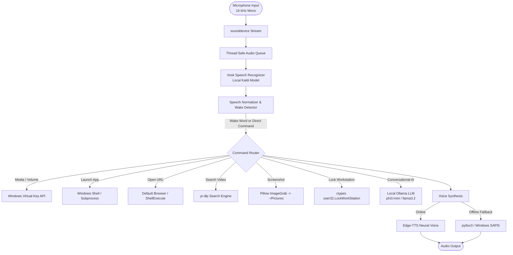

# 🎙️ HeyLiku — Offline Voice Assistant for Windows

<div align="center">


-orange.svg)

-blueviolet.svg)


**HeyLiku** is a lightweight, privacy-focused, offline-first voice assistant designed specifically for Windows. It executes voice commands locally on your machine—opening applications, navigating websites, controlling media volume, snapping screenshots, playing YouTube videos, and holding natural conversations through a local AI model without recurring subscriptions or paid API keys.

[Features](#-key-features) • [Quick Start](#-quick-start--installation) • [Voice Commands](#-voice-commands-reference) • [Configuration](#-customization--configuration) • [Project Structure](#-project-structure) • [Troubleshooting](#-troubleshooting)

</div>

---

## 🌟 Key Features

- 🔒 **100% Offline Core Speech Recognition**: Uses **Vosk** and Kaldi acoustic models to listen and parse speech directly on your device with low latency and total privacy.
- 🗣️ **Dual-Engine Speech Synthesis (TTS)**:
  - **Ultra-Realistic Neural Voice**: Employs Microsoft Edge TTS (`en-US-AnaNeural` by default) for a crisp, natural female voice.
  - **Zero-Drop Offline Fallback**: Automatically switches to Windows SAPI5 (`pyttsx3`) if an internet connection is unavailable.
- 🤖 **Local Generative AI Brain**: Integrates seamlessly with **Ollama** (`phi3:mini` or `llama3.2:1b`) for intelligent conversation and question answering with memory of recent exchanges.
- 🎯 **Flexible Wake-Word Detection & Direct Commands**:
  - Wake triggers: `"Hey Liku"`, `"Liku"`, `"Hi Liku"`, `"Hello Liku"`, `"Ok Liku"`, and fuzzy phonetic variations (e.g., `"leeku"`, `"liko"`, `"like you"`).
  - Can accept commands in one phrase (e.g., *"Hey Liku open Chrome"*) or two-stage dialog (*"Hey Liku"* ➔ *"Yes?"* ➔ *"open VS Code"*).
  - Recognizes direct action commands without repeating the wake word (e.g., *"open youtube"*, *"volume up"*, *"take a screenshot"*).
- 📺 **Intelligent YouTube Search & Playback**: Fast YouTube video search and launch powered by `yt-dlp` directly in your default browser.
- 💻 **App & Website Launcher**:
  - Built-in aliases for popular Windows applications, developer tools (VS Code, PowerShell, CMD), and browsers.
  - Fuzzy matching tolerates slight mispronunciations.
  - System `PATH` command fallback to launch any Windows command-line utility.
- 🎛️ **Native Windows System & Media Controls**:
  - Direct volume adjustment (volume up/down, mute/unmute).
  - Media controls (play, pause, next track, previous track) using Windows Virtual Key events.
  - Instant workstation lock (`LockWorkStation`).
  - Automated full-screen capture saved directly into your Windows `Pictures` folder.
- 🧪 **Comprehensive Offline Test Suite**: Fully automated test suite (`test_liku.py`) validating speech normalization, fuzzy matching, command routing, and query parsing without requiring microphone hardware.

---

## 🏗️ Architecture & How It Works



---

## 📋 Prerequisites & System Requirements

- **Operating System**: Windows 10 or Windows 11 (64-bit).
- **Python**: Version **3.9** or newer (Python 3.10 – 3.12 recommended).
- **Microphone**: Working built-in or external USB microphone set as the Windows default recording device.
- **Audio Output**: Speakers or headphones.
- *(Optional, for AI chat)*: **[Ollama](https://ollama.com/)** installed and running locally.

---

## 🚀 Quick Start & Installation

### 1. Clone or Download the Repository

```bash
git clone https://github.com/Itz30jay/HeyLiku.git
cd HeyLiku
```

### 2. Create and Activate a Python Virtual Environment

It is strongly recommended to use a virtual environment:

```powershell
python -m venv venv
.\venv\Scripts\Activate.ps1
```

> *If script execution is disabled in PowerShell, enable it for your session by running: `Set-ExecutionPolicy -Scope Process -ExecutionPolicy RemoteSigned`*

### 3. Install Required Dependencies

Install all project dependencies listed in `requirements.txt`:

```bash
pip install -r requirements.txt
```

#### Included packages:
| Package | Purpose |
|---|---|
| `vosk` | Offline speech recognition engine |
| `sounddevice` | Audio capture from microphone |
| `pyttsx3` | Offline Windows SAPI5 text-to-speech fallback |
| `edge-tts` | High-definition natural neural TTS voice |
| `pygame-ce` | Low-latency audio playback for speech audio |
| `yt-dlp` | Fast YouTube search and query extraction |
| `ollama` | Local LLM client for conversations |
| `Pillow` | Desktop screenshot capture |

### 4. Download and Set Up the Vosk Speech Model

Liku requires an offline Vosk speech model placed inside a folder named `model` in the project root:

1. Download a lightweight English model from Alphacephei:
   - **Recommended (Indian English)**: [vosk-model-small-en-in-0.4.zip](https://alphacephei.com/vosk/models/vosk-model-small-en-in-0.4.zip) (~36 MB)
   - **Alternative (US English)**: [vosk-model-small-en-us-0.15.zip](https://alphacephei.com/vosk/models/vosk-model-small-en-us-0.15.zip) (~40 MB)
2. Extract the downloaded ZIP archive.
3. Rename the extracted folder to `model` (or copy its contents so that `c:\Liku\model\am`, `conf/`, `graph/`, etc. are present).
4. Verify your directory structure matches:
   ```text
   HeyLiku/
   ├── model/
   │   ├── am/
   │   ├── conf/
   │   ├── graph/
   │   └── ivector/
   ├── liku.py
   └── ...
   ```

*(Note: If you already have the `model/` folder populated in your clone, you can skip this step!)*

### 5. (Optional) Set Up Local AI with Ollama

To enable offline intelligent conversation:

1. Download and install Ollama from [ollama.com](https://ollama.com/download/windows).
2. Open your terminal and pull a lightweight model:
   ```bash
   ollama pull phi3:mini
   # or
   ollama pull llama3.2:1b
   ```
3. Make sure Ollama is running in your background or tray.

---

## 🏃 Running Liku

### 🔄 Every Time You Turn On Your Laptop
Everything (dependencies, Python libraries, speech models) is already permanently installed on your laptop. You **never** need to reinstall anything!

Whenever you switch on or restart your laptop, you have 3 easy ways to start Liku:

#### 1. The Fastest Way (Double-Click):
- Open File Explorer, navigate to `C:\Liku`.
- Double-click [`run.bat`](file:///c:/Liku/run.bat). That's it!

#### 2. From Terminal / PowerShell:
Open PowerShell or Command Prompt and run:
```powershell
cd C:\Liku
.\run.bat
```
*(or `python -u liku.py`)*

#### 3. ⚡ Zero-Click: Start Automatically When Windows Boots
If you want Liku to start by itself every time you turn on your laptop:
1. Press `Win + R` on your keyboard to open the **Run** dialog.
2. Type `shell:startup` and press **Enter** (this opens your Windows Startup folder).
3. Right-click inside the folder ➔ **New ➔ Shortcut**.
4. Browse to and select `C:\Liku\run.bat` (or paste `C:\Liku\run.bat`), then click **Finish**.
5. *Now, whenever you power on your laptop, Liku starts automatically in the background, greets you with "Hello! I'm Liku...", and immediately begins listening for your voice commands!*

> **Note on Local AI (Ollama)**: If you use conversational AI, Ollama typically runs automatically in the Windows taskbar tray. If you ever exited it, simply search "Ollama" in Windows Start and open it.


### 🎯 Pro-Tips for Perfect Voice Accuracy
1. **Speak Naturally & Clearly**: Keep the microphone roughly 15–30 cm away from your mouth.
2. **Wake + Command in One Sentence**: Say `"Hey Liku open Chrome"` or `"Hey like open YouTube"` smoothly for instant execution.
3. **Phonetic Variants Supported**: Whether Vosk hears `"Hey Liku"`, `"Hey Like"`, `"Hey Look"`, or `"Hey Lake"`, it recognizes it instantly.
4. **Direct Fast Commands (No "Hey Liku" Needed)**:
   You don't need to say "Hey Liku"—you can just speak your command directly:
   - `"open youtube"`, `"open vs code"`, `"open chrome"`, `"open notepad"`
   - Or just the app name: `"vs code"`, `"chrome"`, `"notepad"`, `"calculator"`, `"spotify"`, `"youtube"`
   - `"volume up"`, `"volume down"`, `"mute"`, `"take a screenshot"`, `"lock pc"`
5. **Consecutive Commands**: You can give commands one after another seamlessly. The audio queue automatically drains after each command.
6. **Two-Stage Wake**: Say `"Hey Liku"` ➔ wait for Liku to reply *"Yes?"* ➔ then speak your command within 8 seconds.
7. **Microphone Permissions**: Ensure Windows microphone permissions are allowed under *Settings > Privacy & Security > Microphone*.

### Run Test Suite
To verify regex matching, YouTube query extraction, app lookup, and speech normalization offline:
```bash
python test_liku.py
```
*(All 26 automated unit tests should pass with exit code 0).*


---

## 🗣️ Voice Commands Reference

You can talk to Liku in three convenient ways:
1. **Direct Wake + Action**: `"Hey Liku, open VS Code"` (also accepts `"Hey like..."`, `"Hey look..."`)
2. **Without Wake Word**: Just say `"open VS Code"`, `"open YouTube"`, `"volume up"`, or `"VS Code"`
3. **Two-Stage Conversation**: `"Hey Liku"` ➔ *(Liku replies: "Yes?")* ➔ `"play lofi hip hop"`

### 1. Applications & Software

| Spoken Command | Action Taken |
|---|---|
| `"open VS Code"` / `"launch visual studio code"` | Opens Visual Studio Code (`code`) |
| `"open Chrome"` / `"open Google Chrome"` | Opens Google Chrome |
| `"open Edge"` / `"open Microsoft Edge"` | Launches Microsoft Edge |
| `"open Firefox"` | Opens Mozilla Firefox |
| `"open Notepad"` / `"launch notepad"` | Opens Windows Notepad |
| `"open Calculator"` / `"open calc"` | Opens Windows Calculator |
| `"open Paint"` | Opens MS Paint |
| `"open Task Manager"` | Opens Windows Task Manager |
| `"open File Explorer"` / `"open explorer"` | Opens Windows Explorer |
| `"open Command Prompt"` / `"open cmd"` | Opens CMD terminal |
| `"open PowerShell"` | Opens Windows PowerShell |
| `"open Word"` / `"open Excel"` / `"open PowerPoint"` | Launches corresponding MS Office application |
| `"open Spotify"` / `"open WhatsApp"` | Launches desktop Spotify or WhatsApp |
| `"close Chrome"` / `"close Notepad"` / `"close VS Code"` | Gracefully terminates the running process |

### 2. Websites & Web Services

| Spoken Command | Action Taken |
|---|---|
| `"open YouTube"` / `"visit youtube"` | Opens `https://www.youtube.com` |
| `"open Google"` | Opens `https://www.google.com` |
| `"open GitHub"` | Navigates to `https://github.com` |
| `"open Gmail"` | Opens Google Mail |
| `"open ChatGPT"` / `"open Claude"` | Opens ChatGPT or Claude web interface |
| `"open LinkedIn"` / `"open Instagram"` / `"open Facebook"` | Opens social media platforms |
| `"open Stack Overflow"` | Opens Stack Overflow in default browser |
| `"search google for <query>"` / `"google <query>"` | Performs a Google search in browser |

### 3. YouTube Media Search & Playback

| Spoken Command | Action Taken |
|---|---|
| `"play <song / artist / video> on youtube"` | Searches YouTube via `yt-dlp` and automatically plays the top matching video |
| `"search youtube for <query>"` | Finds and launches the best matching video result |
| `"turn on youtube and play <query>"` | Opens the direct video stream link in your default browser |

### 4. Volume, Audio & Media Controls

| Spoken Command | Action Taken |
|---|---|
| `"volume up"` | Increases system master volume by 5 steps |
| `"volume down"` | Lowers system master volume by 5 steps |
| `"mute"` / `"unmute"` | Toggles audio mute |
| `"pause"` / `"resume"` / `"play"` | Toggles media playback (Spotify, YouTube, VLC, etc.) |
| `"next"` / `"next song"` / `"skip"` | Skips to next track |
| `"previous"` / `"previous song"` / `"go back"` | Rewinds or returns to previous track |

### 5. Utilities & System Actions

| Spoken Command | Action Taken |
|---|---|
| `"what time is it"` / `"tell me the time"` | Announces the current local time |
| `"what is the date"` / `"today's date"` | Announces day of the week and full date |
| `"take a screenshot"` / `"capture screen"` | Grabs desktop and saves as `screenshot_YYYYMMDD_HHMMSS.png` into `Pictures/` |
| `"lock computer"` / `"lock screen"` / `"lock pc"` | Locks the Windows workstation session immediately |
| `"stop"` / `"exit"` / `"quit"` / `"goodbye"` | Safely terminates the assistant process |

### 6. General AI Conversation (Ollama)

When a spoken query does not match an app or system command, Liku automatically routes the query to your local Ollama AI:
- *"Hey Liku, what is quantum computing in one sentence?"*
- *"Hey Liku, write a short motivational quote for coding."*
- *"Hey Liku, tell me a quick programming joke."*

---

## ⚙️ Customization & Configuration

All core settings are easily configurable at the top of [`liku.py`](file:///c:/Liku/liku.py):

### 1. Changing Voice & Speech Settings

```python
# Choose your favorite neural voice:
# "en-US-AvaNeural"              <- Warm, sweet, expressive 20-year-old girl voice (Default, ultra-realistic)
# "en-US-EmmaNeural"             <- Soft, gentle, pretty young woman voice
# "en-US-JennyNeural"            <- Cheerful, friendly conversational assistant
# "en-IN-NeerjaExpressiveNeural" <- Expressive young Indian-English female voice
NEURAL_VOICE = "en-US-AvaNeural"
VOICE_PITCH = "+0Hz"             # e.g., "+0Hz" or "+2Hz" for bright tone
VOICE_SPEED = "+0%"              # e.g., "+0%" or "-3%"
USE_NEURAL_VOICE = True          # Falls back to pyttsx3 offline automatically
```

### 2. Adding Custom Applications

Add your application to the `APPS` dictionary with either its executable command or full Windows path:

```python
APPS = {
    # Existing apps...
    "blender": r'"C:\Program Files\Blender Foundation\Blender 4.0\blender.exe"',
    "discord": r'"C:\Users\<YourUsername>\AppData\Local\Discord\Update.exe --processStart Discord.exe"',
}
```

### 3. Adding Custom Process Names for Closing Apps

Map what you say to the process name shown in Windows Task Manager:

```python
PROCESS_NAMES = {
    # Existing processes...
    "blender": "blender.exe",
    "discord": "Discord.exe",
}
```

### 4. Adding Custom Websites

Add entries to the `WEBSITES` dictionary:

```python
WEBSITES = {
    # Existing sites...
    "reddit": "https://www.reddit.com",
    "notion": "https://www.notion.so",
}
```

### 5. Configuring Ollama Model

Specify your preferred local model:

```python
OLLAMA_MODEL = "phi3:mini"       # e.g. "llama3.2:1b", "mistral", or "gemma2:2b"
```

---

## 📁 Project Structure

```text
c:\Liku\
├── model\                     # Vosk offline acoustic model directory
│   ├── am\                    # Acoustic model data
│   ├── conf\                  # Model configuration (model.conf, mfcc.conf)
│   ├── graph\                 # HCLG decoding graph & phoneme dictionary
│   └── ivector\               # Speaker adaptation vectors
├── run.bat                    # One-click Windows batch launcher
├── generate_liku.py           # Helper script for building/deploying assistant files
├── liku.py                    # Main assistant engine (audio loop, TTS, command router)
├── test_liku.py               # Unit test suite verifying offline command parsing
├── requirements.txt           # Python dependencies
├── LICENSE                    # MIT License
└── README.md                  # Comprehensive documentation
```

---

## 🔧 Troubleshooting

### 1. `ERROR: Vosk model not found!`
- Make sure the folder containing model files is named exactly `model` in the root of the project.
- Verify that `model/model.conf` or `model/conf/model.conf` exists.

### 2. `ERROR: Could not open microphone`
- Check Windows Privacy settings: **Settings ➔ Privacy & Security ➔ Microphone** and ensure **"Let apps access your microphone"** and **"Let desktop apps access your microphone"** are toggled **ON**.
- Check that another app isn't holding exclusive control over the microphone.

### 3. Voice is lagging or sound crackles
- Ensure `pygame-ce` is installed instead of standard `pygame`.
- If your internet connection is unstable, Edge-TTS may timeout; Liku will seamlessly fall back to offline `pyttsx3`. You can also set `USE_NEURAL_VOICE = False` in `liku.py` for strictly offline instant speech.

### 4. Local AI Chat says "I can't reach the Ollama server"
- Ensure Ollama is installed and running (`ollama serve` or open the Ollama desktop tray application).
- Verify model availability by running `ollama list` in PowerShell.

---

## 📄 License

This project is open source and licensed under the [MIT License](file:///c:/Liku/LICENSE).

Copyright (c) 2026 **Jaykishan Das**.